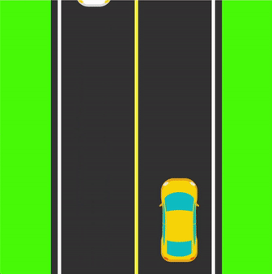

# Corrida de carros

## Informações

**Curso de Programação Web**

Componente curricular: Lógica de Programação

Professora: Gisliany Alves

Discentes: João Victor Gonçalves Farias, Arllen Felipe Medeiros de Souza

## Instruções

Primeiramente, vamos instalar uma dependência, executando o seguinte código no terminal:

    pip install pygame

A forma de executar esse projeto é 

    python main.py

As instruções para fazer o jogo funcionar estão no arquivo `car_race.md`.
