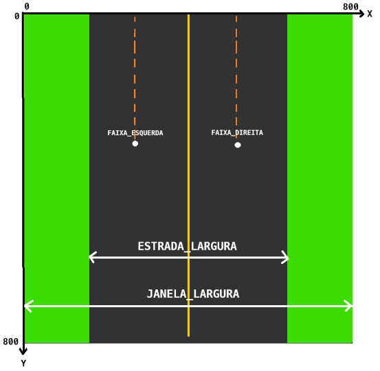
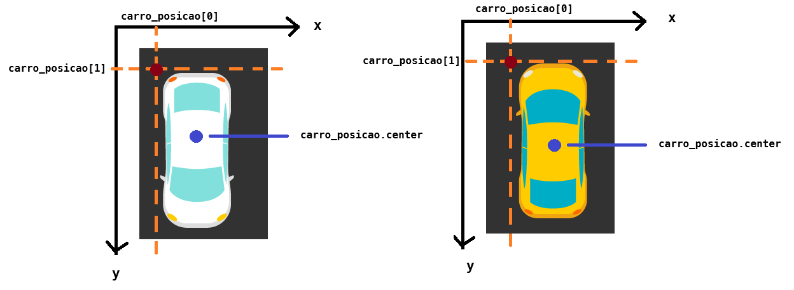

# Corrida de carros

A ideia é que o jogador tente desviar seu carro de outro veículo que vem no sentido oposto. O desafio consiste em continuar dirigindo e evitando a colisão enquanto a velocidade do jogo aumenta com o passar do tempo.

## Arquivos

Temos três arquivos .py sobre os quais iremos trabalhar:
- `main.py`: arquivo que tem a lógica principal do nosso jogo. Nele, iremos fazer a chamada de outras funções e encadearemos o nosso código.
- `visual.py`: módulo que contém variáveis globais e funções que controlam o visual do jogo, desenhando elementos na tela.
- `mecanica.py`: módulo que contém funções responsáveis por controlar a logística do jogo em si, como a verificação de colisão, aumento de velocidade, etc.

## Tarefas

1. Em `visual.py`, começaremos criando o necessário para desenhar uma estrada, com suas linhas central e laterais. Para isso, precisamos inicializar algumas das variáveis globais:
   - `ESTRADA_LARGURA` deve ser 60% da variável `JANELA_LARGURA`
   - `MARCAS_ESTRADA_LARGURA` deve ser 1% da variável `JANELA_LARGURA`
  
   - `FAIXA_DIREITA`, que representa a ponto central horizontal da faixa da direita, deve ser igual a `JANELA_LARGURA` dividida por 2, somada à `ESTRADA_LARGURA` dividida por 4.
   - `FAIXA_ESQUERDA`, que representa a ponto central horizontal da faixa da esquerda, deve ser igual a `JANELA_LARGURA` dividida por 2, subtraída da `ESTRADA_LARGURA` dividida por 4.
   
    Tente entender o porquê dessas duas últimas variáveis serem calculadas assim ao observar a imagem a seguir. Veja também que o sistema de coordenadas para a janela começa no canto superior esquerdo.
    

2. No arquivo `main.py`, vamos importar tudo o que precisaremos:
   - Faça a importação da biblioteca `pygame`
   - De `pygame.locals`, faça a importação de tudo
   - Importe os módulos mecanica e visual

3. Nesse mesmo arquivo, vamos criar algumas variáveis. A partir desse ponto, para cada variável feita, re-execute o arquivo python.
   - `janela`: controla a janela que se abre do jogo. Essa variável receberá o retorno da chamada da função `inicializar_jogo` do módulo visual.
   - `carro`: controla o desenho do carro do jogador. Essa variável receberá o retorno da chamada da função `inicializar_carro` do módulo visual, passando como parâmetro o tipo 'jogador'. 
   - `carro2`: controla o desenho do carro do oponente. Essa variável receberá o retorno da chamada da função `inicializar_carro` do módulo visual, passando como parâmetro o tipo 'oponente'.
   - `carro_loc`: contém as coordenadas de `carro`. Essa variável receberá o retorno da chamada da função `posicionar_carro` do módulo visual, passando como parâmetros a variável `carro`, a posição horizontal FAIXA_DIREITA do módulo visual (assim como as funções, variáveis globais também podem ser importadas), e a posição vertical igual a 80% de JANELA_ALTURA do módulo visual.
   - `carro2_loc`: contém as coordenadas de `carro2`. Essa variável receberá o retorno da chamada da função `posicionar_carro` do módulo visual, passando como parâmetros a variável `carro2`, a posição horizontal FAIXA_ESQUERDA do módulo visual (assim como as funções, variáveis globais também podem ser importadas), e a posição vertical igual a 20% de JANELA_ALTURA do módulo visual.
   - `contador`, que deve ser inicializado com zero.
   - `velocidade`, que é a velocidade do jogo e deve ser inicializada com um.

4. Procure pela linha em que a função `desenhar_carros` é chamada. Vamos adicionar seu segundo argumento: uma matriz. A primeira linha dela deve conter as varáveis `carro` e `carro_loc`, enquanto a segunda linha deve ter as variáveis `carro2` e `carro2_loc`.

  Agora, dentro do while, precisaremos criar toda a mecânica do jogo: fazer o carro adversário se movimentar aleatoriamente, alternar de faixa o veículo do jogador caso ele use as teclas de setinha (ou as teclas a/d) e verificar se houve colisão entre os carros. Cada uma dessas ações terá uma função, a ser definida no arquivo `mecanica.py` e chamada na `main.py`.

5. Vamos começar definindo uma função `mover_adversario_aleatoriamente` em `mecanica.py`, quem tem como parâmetros `carro_posicao` e `velocidade`.
   - Mover o carro nada mais é do que alterar sua posição vertical (eixo y) na tela. Considere que `carro_posicao` é uma variável especial que obtivemos do pygame e que funciona como uma lista: no índice zero temos a posição da lateral esquerda do carro (eixo x) e no índice um, a posição do topo (eixo y). Então, vamos incrementar sua posição vertical, somando-a à variável velocidade.
   
   - Faça a chamada da função em `main.py`, passando como argumentos as variáveis `carro2_loc` e `velocidade` e atribuindo seu resultado de volta à `carro2_loc`. Execute o programa e veja o que acontece.
   - Em algum momento, o carro adversário vai ultrapassar a altura da nossa janela. Vamos voltar a definição da função. Crie uma condicional que verifique se a posição vertical do carro é maior que `JANELA_ALTURA`.
   - Se for o caso, vamos trazer o carro de volta para o início. Como `carro_posicao[1]` se refere à coordenada traseira do carro, se colocarmos zero nela, nosso reaparecerá inteiro de uma vez (teste isso e veja com seus próprios olhos). Então, precisamos recorrer a um valor negativo exatamente igual à variável global `VEICULO_ALTURA`. Faça essa alteração e execute novamente.
   - O carro adversário sempre fica na mesma faixa, né? Vamos aproveitar para mudá-lo de faixa aleatoriamente ainda dentro da condicional. Assim, sempre que o carro sumir na janela, ele tem a chance de aparecer ou não em uma faixa diferente.
     - Comece gerando um número aleatório 0 ou 1 (lembra do módulo `random` e da função `randint`?) e colocando-o na variável `faixa`.
     - Para mudar de faixa, verificaremos se a variável `faixa` é zero e, se for, chame a função `alternar_faixa`, passando como argumentos `carro_posicao` e `FAIXA_ESQUERDA`. Se for 1, chame novamente a função, apenas mudando o segundo parâmetro para `FAIXA_DIREITA`. Execute o programa e veja o que acontece.

6. Massa, em? Que tal deixarmos agora que o jogador possa mover seu veículo de faixa?
   - No arquivo `main.py`, descomente o trecho de três linhas dentro do `for`, relativo aos eventos do tipo KEYDOWN. Nesse trecho do código, o pygame nos permite verificar quais teclas o usuário está apertando.
   - Na condicional que verifica se essa tecla é `K_a` (letra a) ou `K_LEFT` (←), chame a função `alternar_faixa` para mover o carro para a faixa da esquerda (do jeito que você no item 5).
   - Tente replicar a condicional anterior, agora para as teclas `K_d` (letra d) ou `K_RIGHT` (→). Lembre de chamar novamente `alternar_faixa`. Após, fazer isso, execute o programa e tente mover o carro amarelo apertando as teclas de setinha pros lados ou as teclas a,d.

7. Agora, precisamos verificar quando houver colisão entre os veículos para encerrar o jogo. Retorne ao arquivo `mecanica.py` e crie uma função `houve_colisao`, que tem os parâmetros `carro_posicao` e `carro2_posicao`. Essa função deve retornar True se houver colisão ou False, caso contrário.
    - Considerando que os parâmetros também funcionam como no item 5 (cada um deles é uma lista que no índice zero tem a posição da lateral esquerda do carro e no índice um, a posição do topo), tente imaginar e criar a condição em que uma colisão acontece.
    - No arquivo `main.py`, dentro do while, chame a função criada passando `carro_loc` e `carro2_loc` como argumentos e atribua seu resultado à variável `bateu`. Se bateu for verdadeira, imprima "GAME OVER!" e interrompa o laço de repetição. Tente jogar.

8. O jogo é até legal, mas depois de um tempo vai ficando chatinho, né? Que tal conferirmos um ar de desafio a ele?
   - Em `mecanica.py`, vamos criar uma função `subir_nivel`, que recebe a `velocidade` como parâmetro. Essa função deve incrementar a variável `velocidade` em 0.5, exibir a mensagem "Subiu de nível - Velocidade: {velocidade}" e retornar a variável `velocidade`.
   - No arquivo `main.py`, dentro do while, verifique com uma condicional se a variável `contador` atingiu 5000. Se for o caso, chame a nossa função `subir_nivel` passando velocidade e reatribuindo seu retorno a essa mesma variável. Nessa mesma condicional, zere `contador`.
   - Não esqueça de incrementar contador em 1 fora da nossa condicional, mas ainda dentro do while. Tente jogar agora.

9.  Fora do laço while, chame a função `encerrar_jogo` do módulo visual.

10. O que é um jogo sem música, né? Na `main.py`, chame a função `inicialiar_musica()` do módulo visual, na linha segunte à da criação da variável `janela`.